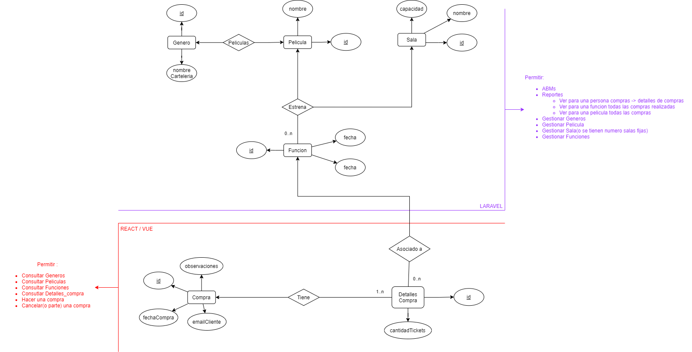

## Diagrama de Entidad-Relacion

## Respecto al Proyecto Framework PHP - Laravel :
Las entidades que se podran actualizar seran:
- Peliculas -> Se podra agregar/quitar peliculas.
- Generos -> Se podran agregar/quitar generos.
- Salas -> Se podran agregar/quitar salas.
- Funciones -> Se podran agregar/quitar funciones, que mostraran peliculas en una sala en una fecha y hora determinadas.

Los reportes que se podran generar o visualizar seran:
- Generos -> Se podran consultar las peliculas asociadas a un genero, o los generos existentes.
- Peliculas -> Se podran consultar las funciones que muestre esa pelicula, y su fecha y hora, o su sala asociadas. Tambien se podran visualizar el total de tickets comprados, de todas las funciones asociadas a esa pelicula
- Funcion -> Se podra consultar la fecha y hora de una funcion, su pelicula y/o sala asociada, la cantidad de asientos disponibles o tickets comprados para esa funcion.
- Compra -> Se podran ver compras existentes, y para una compra todos los detalles de compra asociados a esta.

Las entidades que se podran obtener por API seran:
- Peliculas
- Generos
- Compras
- Detalles de Compra

Las entidades que se podran modificar por API seran:
- Peliculas
- Generos
- Sala
- Funcion
- Compra/Detalles de Compra

## Respecto al Proyecto Javascript - React/Vue :
La informacion que podra ver el usuario sera:
- Generos -> Lista de peliculas asociadas a ese genero, y lista de generos existentes
- Pelicula -> Para una pelicula todas las funciones disponibles, y su fecha y hora, y sala asociada.
- Compra -> La fecha de creacion de la compra, informacion de los detalles de compra asociados a una compra
- Detalles Compra -> Funcion asociada, numero de tickets asociados a esa compra

Las acciones que podra realizar el usuario cuando ingrese a la aplicacion son:
- Consultar los detalles de un genero de peliculas(su nombre, peliculas asociadas)
- Consultar detalles de una pelicula(su nombre, sus funciones asociadas)
- Consultar detalles de funciones disponibles(que peliculas estrenan, en que fecha y hora, y en que sala)
- Crear/cancelar/confirmar una Compra
- Añadir o quitar Detalles de Compra a una Compra creada

## Librerias utilizadas:
Se utilizaron las siguientes librerias en la implementacion de este proyecto:
-<a href="https://github.com/JulienRAVIA/FakerCinemaProviders"> extension de libreria Faker, con datos relacionados a peliculas, cinemas, generos, shows de tv, etc...</a>
